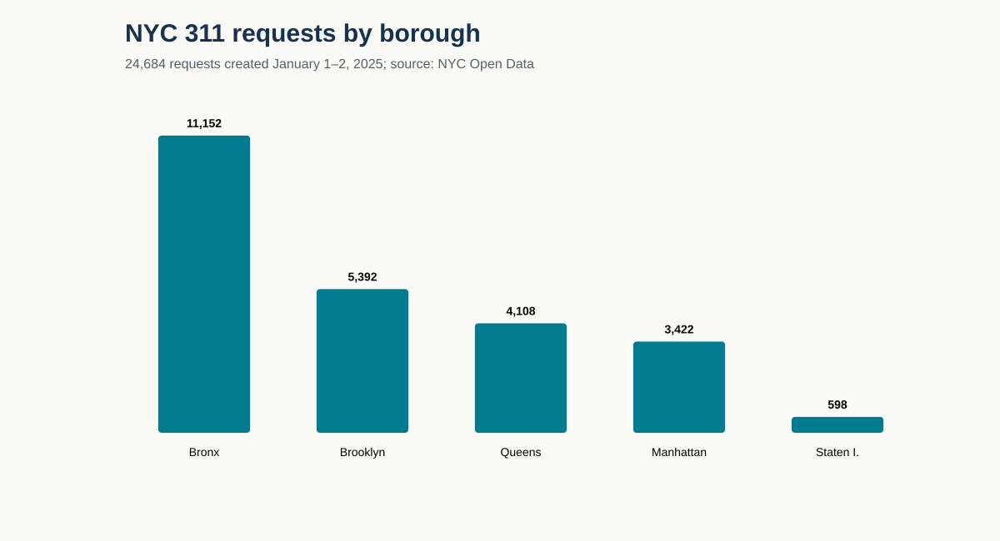
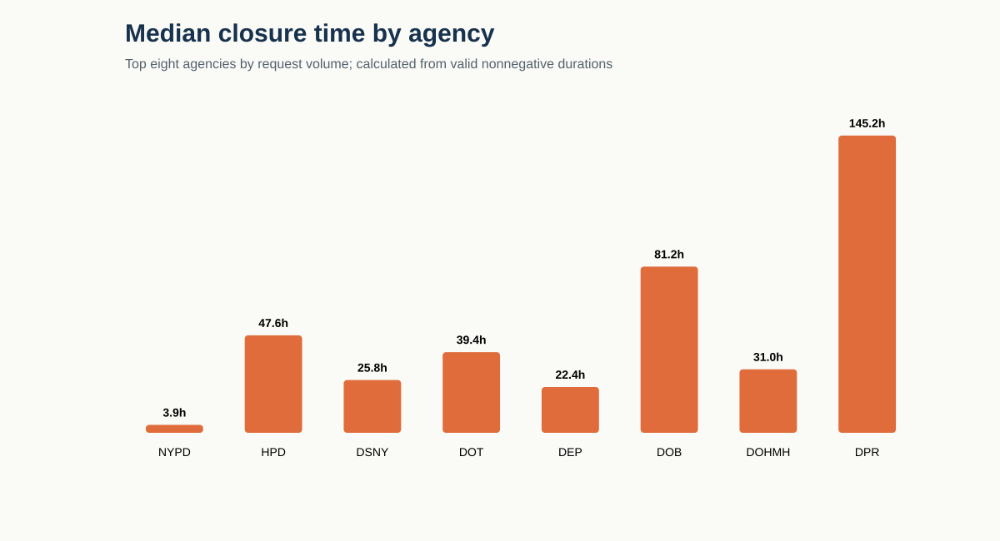

# NYC 311 Pipeline Observatory

A checkpointed ingestion and data-quality project built from **24,684 factual NYC 311 service requests** created on January 1–2, 2025. It treats public data like a production feed: deterministic pagination, restart checkpoints, schema projection, source hashing, integrity tests, and auditable operational metrics.

Dataset: [NYC Open Data — 311 Service Requests from 2020 to Present](https://dev.socrata.com/foundry/data.cityofnewyork.us/erm2-nwe9), dataset ID `erm2-nwe9`.

## Why this is a reliability project

The difficult part is not drawing a chart. It is making sure the chart can be defended. The pipeline therefore records the exact time window, query ordering, retrieval timestamp, row count, and SHA-256 of the raw snapshot. Every summary is rebuilt from the checked-in records.

The ingestion path uses ordered 5,000-row pages. Each page is flushed to a partial file before an atomic checkpoint replacement. On restart, rows beyond the durable checkpoint are rolled back before retrieval resumes, preventing duplication after an interruption between the data and checkpoint writes. A retry uses exponential backoff. The recovery test uses records from the checked-in factual snapshot rather than generated rows.

## Findings from the snapshot

- 24,684 rows contained 24,684 unique request IDs: no duplicate IDs were observed.
- All `created_date` values parsed, and no closed request had a closure timestamp earlier than creation.
- 24,490 records had a valid closure duration. Their median was 12.24 hours and p90 was 171.79 hours.
- Location completeness was imperfect: latitude/longitude were absent in 223 rows (0.90%); ZIP code was absent in 137 (0.55%).
- Residential noise was the largest complaint type with 9,637 requests (39.04%).
- The Bronx accounted for 11,152 requests (45.18%) in this two-day window.



Agency closure times should not be read as a league table: agencies receive different work, and closed timestamps represent administrative workflows rather than standardized service-level agreements. They are shown to expose the distribution and its long tail.



Among the eight highest-volume agencies, observed median valid closure time ranged from 3.86 hours for NYPD to 145.16 hours for DPR. HPD's median was 47.60 hours, while its p90 was 1,041.91 hours—a strong reason to report a tail percentile rather than only an average.

## Reproduce

```bash
python src/ingest.py
python -m unittest discover -s tests -v
python src/validate.py
python src/analyze.py
python src/create_charts.py
```

`src/ingest.py` calls the official API. The remaining steps run offline with the Python standard library.

## Evidence and boundaries

- `data/raw/source_manifest.json` holds the API endpoint, query window, retrieval time, row count, and snapshot hash.
- `data/raw/nyc311_2025-01-01_to_2025-01-02.csv` is the unmodified field projection returned by the API.
- `data/processed/agency_performance.csv` and `results/summary.json` are calculated outputs.
- The two-day New Year window is intentionally bounded and may have holiday effects. Results are not generalized to annual demand.
- Closure duration is `closed_date - created_date`; it is not claimed to equal labor time, response time, or SLA compliance.
- Missing coordinates are reported, not imputed.
- No synthetic rows, inferred demographics, or invented operational incidents are included.

## Repository structure

```text
data/raw/          factual snapshot and provenance manifest
data/processed/    derived agency-level metrics
results/           machine-readable quality and outcome summary
assets/            charts generated from results
src/               checkpointed ingestion, analysis, and visualization
tests/             deterministic calculation tests
docs/              design and decision record
```
